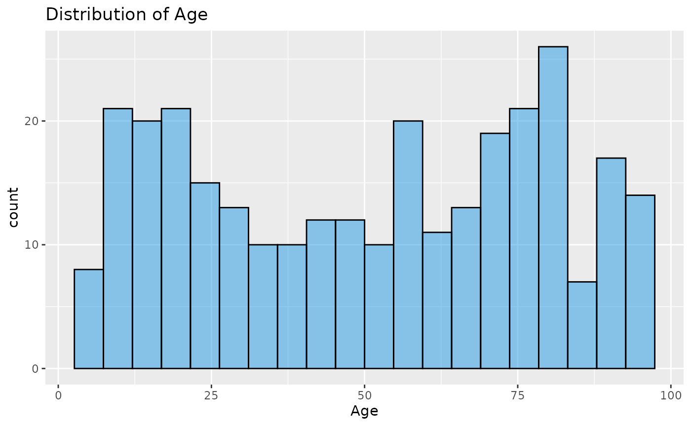
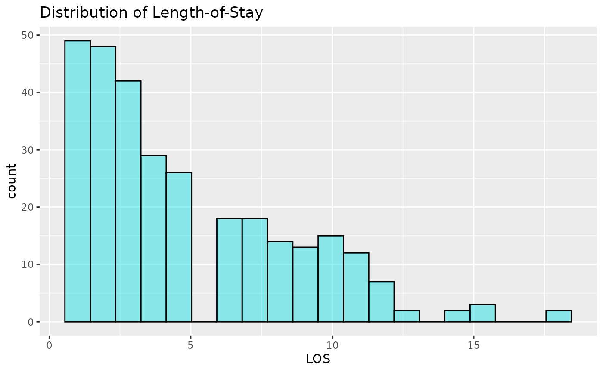

# Dataset: A simulated hospital length-of-stay (LOS)

*Edited by Zoë Turner 28 August 2026*

This vignette details why the `LOS_model` dataset was created, how to
load it, and gives examples of use for learning/teaching regression
modelling using Generalized Linear Models (GLMs), and related
techniques.

The data were created specifically for regression tutorials, simulating
a small set of data on hospital in-patient spells. The data are 10 sets
of 30 simulated patient records, representing 10 different hospitals
(“Trusts”).

The dataset contains:

- **ID:** an integer value patient number
- **Organisation:** A factor, containing hospital name, for example
  “Trust1”
- **Age:** an integer representing patient age in years
- **LOS:** ‘Length of Stay,’ an integer representing the number of days
  a patient was in hospital
- **Death:** an integer flag (0 or 1) representing whether a patient
  died

## First, load the data and inspect it

``` r

library(NHSRdatasets)
library(dplyr)
library(ggplot2)
library(ModelMetrics)
library(lme4)
library(lmtest)

LOS_model <- NHSRdatasets::LOS_model

head(LOS_model)
#> # A tibble: 6 × 5
#>      ID Organisation   Age   LOS Death
#>   <int> <ord>        <int> <int> <int>
#> 1     1 Trust1          55     2     0
#> 2     2 Trust2          27     1     0
#> 3     3 Trust3          93    12     0
#> 4     4 Trust4          45     3     1
#> 5     5 Trust5          70    11     0
#> 6     6 Trust6          60     7     0

summary(LOS_model)
#>        ID          Organisation      Age             LOS        
#>  Min.   :  1.00   Trust1 : 30   Min.   : 5.00   Min.   : 1.000  
#>  1st Qu.: 75.75   Trust2 : 30   1st Qu.:24.00   1st Qu.: 2.000  
#>  Median :150.50   Trust3 : 30   Median :54.00   Median : 4.000  
#>  Mean   :150.50   Trust4 : 30   Mean   :50.66   Mean   : 4.937  
#>  3rd Qu.:225.25   Trust5 : 30   3rd Qu.:75.25   3rd Qu.: 7.000  
#>  Max.   :300.00   Trust6 : 30   Max.   :95.00   Max.   :18.000  
#>                   (Other):120                                   
#>      Death       
#>  Min.   :0.0000  
#>  1st Qu.:0.0000  
#>  Median :0.0000  
#>  Mean   :0.1767  
#>  3rd Qu.:0.0000  
#>  Max.   :1.0000  
#> 

# 82.3% survived
prop.table(table(LOS_model$Death))
#> 
#>         0         1 
#> 0.8233333 0.1766667
```

Now lets look at the distributions of Age and LOS. We might expect Age
to be normally distributed, but this would be unrealistic, as elderly
patient represent higher proportions of the total in-patients. It could
be uniform, it could be bi-modal (or have more peaks), but nothing is
particularly clear. LOS is highly right-skewed. This means that the high
values will affect the mean, dragging it out, and the median would be a
better estimation of the centre of the distribution. This shows that
most patients don’t stay very long, but a few patients stay notably
longer.

``` r

ggplot2::ggplot(LOS_model, aes(x = Age)) +
  ggplot2::geom_histogram(alpha = 0.5, col = 1, fill = 12, bins = 20) +
  ggplot2::ggtitle("Distribution of Age")
```



``` r


ggplot2::ggplot(LOS_model, aes(x = LOS)) +
  ggplot2::geom_histogram(alpha = 0.5, col = 1, fill = 13, bins = 20) +
  ggplot2::ggtitle("Distribution of Length-of-Stay")
```



## Modelling LOS and Death

We will attempt to model LOS, using Age and Death, and also to model
Death using LOS and Age. This vignette does not describe linear models
per se, but assumes you are familiar with linear regression. If not,
pause here and do a little reading before you continue.

Our data are not continuous, linear, or normally distributed. Death is
binary, LOS is a count. We can extend the linear model idea for this as
a Generalized Linear Model (GLM)^(\[1\]) , by fitting our model via a
‘link function.’ This function transforms data and allows our response,
and it’s variance, to relate to a linear model through the link
function:

\$\$\large{g(\mu)= \alpha + \beta x}\$\$ Where $`\mu`$ is the
expectation of Y, and $`g`$ is the link function

  

The Ordinary Least Squares (OLS) fitting technique used in linear
regression, is not a good fit here as our data are not necessarily
distributed like that. Here we can use ‘maximum-likelihood estimation’
(MLE). MLE is related to probability and can be used to identify the
parameters that were most likely to have produced our data (the largest
likelihood value, or ‘maximum likelihood’).

MLE is an iterative process, and is actually performed on the
log-likelihood. The model is iteratively refitted to maximise the
log-likelihood. Our model is said to ‘converge’ when we can’t improve it
any more (usually changes in the log-likelihood \< 1e-8). **If you get
convergence-related error messages, it means the modelling function
can’t settle on, or reach the MLE. This often means that the scale of
you model predictors is mismatched (for example one is binary (0,1), and
another is on log scale), or there correlations in your data.**

  

Although many of the methods for `lm` are common to `glm`, inspecting
plots of residuals is trickier. We also can’t use R² either, as the
assumptions reflect OLS. Various methods other methods exist, depend on
what you want to compare, including:

- **AUC:** For binary (or other multiple categorical models), the ‘area
  under the receiver operator characteristic curve’ (‘AUC’, ‘ROC’ or
  ‘C-statistic’) can be used and interpreted like R², as the proportion
  of variation in $`y`$ explained by our model.
- **Likelihood Ratio test (LRT):** Two `glm`s can be compared using
  likelihood ratio tests, that compare the log-likelihoods between two
  models. We test a reduced model against the larger model, with the
  null hypothesis that the two likelihoods are not significantly
  different. If our test is positive (usually p\<0.05, but beware of
  p-values…), our models are significantly different, with the one with
  higher log-likelihood the better model.
- **Akaike Information Criterion (AIC) ^(\[2\]):** is a measure of
  relative information loss. The value cannot be directly interpreted,
  but can be compared between models, with lower AICs suggesting less
  information loss, and being ‘better’ models.
- **Prediction error:** If your model is primarily about prediction, and
  less about explanation^(\[3\]), measures of fit such as Mean-Square
  Error of Mean Absolute error can be helpful measures of predictive
  accuracy.

## Generalized Linear Models

Let’s fit a generalized linear model, firstly for `Death`, and secondly
for `LOS`.

### Modelling death:

`Death` is a binary variable recorded in our `LOS_model` dataset. This
cannot be linear and is usually modelled using the `binomial` family
argument, and the `logit` link function. This link function is the
default in `R` for `binomial` regressions, and is commonly referred to
as **Logistic Regression**. We’ll fit this using the `glm` function.
Rather than fitting `Death` as such, the link function makes this the
log-odds of death.

``` r

glm_binomial <- glm(Death ~ Age + LOS, data = LOS_model, family = "binomial")

summary(glm_binomial)
#> 
#> Call:
#> glm(formula = Death ~ Age + LOS, family = "binomial", data = LOS_model)
#> 
#> Coefficients:
#>              Estimate Std. Error z value Pr(>|z|)    
#> (Intercept) -2.435539   0.370818  -6.568  5.1e-11 ***
#> Age          0.003602   0.006372   0.565   0.5719    
#> LOS          0.127344   0.044359   2.871   0.0041 ** 
#> ---
#> Signif. codes:  0 '***' 0.001 '**' 0.01 '*' 0.05 '.' 0.1 ' ' 1
#> 
#> (Dispersion parameter for binomial family taken to be 1)
#> 
#>     Null deviance: 279.78  on 299  degrees of freedom
#> Residual deviance: 267.06  on 297  degrees of freedom
#> AIC: 273.06
#> 
#> Number of Fisher Scoring iterations: 4

ModelMetrics::auc(glm_binomial)
#> [1] 0.6594225
```

Using the `summary` function, we can see our model output, including:

- The ‘call’, of model formula
- A description of the distribution of the deviance residuals (don’t
  worry about this for now).
- The ‘coefficients’, the estimates of the effects of our predictors,
  including their standard errors, and z-tests for their ‘significance.’
  There is a legend, using `*`, to indicate the significance levels.
- Information on fit statistics
- We also used the `ModelMetrics` package to calculate the `auc`. This
  is suggests that ~66% of the variation in our data can be explained by
  our model.

If we consider the logic of the model above, it is telling us that LOS
is a significant predictor for the log-odds of death, but that age is
not. This seems unlikely, unless Age and LOS are not independent. If
this is the case, for example elderly patients stay longer or that
shorter staying elderly patients are more likely to have died, the
effects of LOS may be obscuring the effects of Age. This is referred to
as confounding. We can examine this using an **interaction** term.

### Interactions

‘Interactions’ are where predictor variables affect each other. For
example, the Hospital Standardised Mortality Ratio (HSMR) ^(\[4\]) uses
an interaction term between co-morbidity and age. So co-morbidities
score may have different effects related to age, as well as the
independent effects of age and co-morbidity score.

We can add these to our models with `*` to include the interaction and
the independent terms, or `:` if you just want the interaction without
the independent terms:

``` r

glm_binomial2 <- glm(Death ~ Age + LOS + Age * LOS, data = LOS_model, family = "binomial")

summary(glm_binomial2)
#> 
#> Call:
#> glm(formula = Death ~ Age + LOS + Age * LOS, family = "binomial", 
#>     data = LOS_model)
#> 
#> Coefficients:
#>              Estimate Std. Error z value Pr(>|z|)    
#> (Intercept) -4.516296   0.747036  -6.046 1.49e-09 ***
#> Age          0.042619   0.011875   3.589 0.000332 ***
#> LOS          0.544862   0.135868   4.010 6.07e-05 ***
#> Age:LOS     -0.006988   0.001918  -3.643 0.000269 ***
#> ---
#> Signif. codes:  0 '***' 0.001 '**' 0.01 '*' 0.05 '.' 0.1 ' ' 1
#> 
#> (Dispersion parameter for binomial family taken to be 1)
#> 
#>     Null deviance: 279.78  on 299  degrees of freedom
#> Residual deviance: 247.94  on 296  degrees of freedom
#> AIC: 255.94
#> 
#> Number of Fisher Scoring iterations: 5

ModelMetrics::auc(glm_binomial2)
#> [1] 0.7068597
```

Now our model is suggesting that Age, LOS and their interaction are
significant. This suggests that, as well as their own effects, their
combination is important, and their effects confound each other.

## Prediction

Now we have built a model, we can use it to predict our expected $`y`$,
the probability of death per patient in this case. We can supply a new
dataset to fit it to, using `newdata`, or omitting this fits our model
to the original dataset. Using a `glm`, we have built a model via a link
function, so we need to decide what scale to make our predictions on:
the `link` scale (the log-odds of death in this case) or the `response`
(the probability of death in this case).

``` r

LOS_model$preds <- predict(glm_binomial2, type = "response")

head(LOS_model, 5)
#> # A tibble: 5 × 6
#>      ID Organisation   Age   LOS Death  preds
#>   <int> <ord>        <int> <int> <int>  <dbl>
#> 1     1 Trust1          55     2     0 0.136 
#> 2     2 Trust2          27     1     0 0.0470
#> 3     3 Trust3          93    12     0 0.140 
#> 4     4 Trust4          45     3     1 0.129 
#> 5     5 Trust5          70    11     0 0.285
```

We have added our predictions back into the original `data.frame` using
the column name `preds`, and patient ID 1 has a risk of death of 0.136
or 13.6% probability of death. These predictions can be used in many
different applications, but common uses of them are identifying the
highest risk patients for clinical audit, comparing ratios of the
observed deaths and expected deaths (sum of the probability), or
risk-adjusted control chart monitoring.

## Length of Stay (LOS)

LOS, the time a patient is in hospital, is another variable to examine
in the dataset. This is a count, and is therefore bounded at zero (can’t
have counts \< 0), can only take integer values (for example 2 or 3, but
not 2.5) and is heavily right-skewed, as most patient are only admitted
for one or two days, but rarely patients are in for much longer. We’ll
apply a similar modelling approach to the last example, but the `family`
argument and link function must be different. We will use the `Poisson`
distribution and the natural logarithm link function, the standard
choices for count data^(\[5\]).

``` r

glm_poisson <- glm(LOS ~ Age * Death, data = LOS_model, family = "poisson")

summary(glm_poisson)
#> 
#> Call:
#> glm(formula = LOS ~ Age * Death, family = "poisson", data = LOS_model)
#> 
#> Coefficients:
#>              Estimate Std. Error z value Pr(>|z|)    
#> (Intercept)  0.514456   0.078345   6.567 5.15e-11 ***
#> Age          0.018097   0.001169  15.479  < 2e-16 ***
#> Death        1.491162   0.140864  10.586  < 2e-16 ***
#> Age:Death   -0.020209   0.002187  -9.240  < 2e-16 ***
#> ---
#> Signif. codes:  0 '***' 0.001 '**' 0.01 '*' 0.05 '.' 0.1 ' ' 1
#> 
#> (Dispersion parameter for poisson family taken to be 1)
#> 
#>     Null deviance: 752.23  on 299  degrees of freedom
#> Residual deviance: 459.77  on 296  degrees of freedom
#> AIC: 1429
#> 
#> Number of Fisher Scoring iterations: 5
```

We can’t use the `AUC` value here, as that is related to categories. We
can only make comparisons between models or in terms of prediction
error. Lets fit the same model without the interaction and see if it is
different using the `AIC` or the likelihood ratio test (that tell you
the same thing):

``` r

glm_poisson2 <- glm(LOS ~ Age + Death, data = LOS_model, family = "poisson")

AIC(glm_poisson)
#> [1] 1428.967
AIC(glm_poisson2)
#> [1] 1508.352

# anova(glm_poisson2, glm_poisson, test="Chisq")  will do the same thing without using the lmtest package
lmtest::lrtest(glm_poisson, glm_poisson2)
#> Likelihood ratio test
#> 
#> Model 1: LOS ~ Age * Death
#> Model 2: LOS ~ Age + Death
#>   #Df  LogLik Df  Chisq Pr(>Chisq)    
#> 1   4 -710.48                         
#> 2   3 -751.18 -1 81.385  < 2.2e-16 ***
#> ---
#> Signif. codes:  0 '***' 0.001 '**' 0.01 '*' 0.05 '.' 0.1 ' ' 1
```

Our `AIC` is lower for the interaction model, and the likelihood ratio
test suggest the reduced model is significantly worse.

### Overdispersion

One of the downfalls of a Poisson models that it’s variance is fixed.
This is always proportional to the conditional mean. I will spare you
the maths at this point, but what it means is that the variance doesn’t
scale to the data. This would be fine if our data were perfectly Poisson
distributed, but that is rare in practice. Data commonly display more
variance than we would expect, and this is referred to as
***overdispersion*** (OD). OD causes us to underestimate the variance in
our model, and our assessments of the significance of parameters are too
optimistic because our error is too small. It also affects overall
assessment of model fit.

We can test for this, by comparing the ratio of the sum of the squared
Pearson residuals over the degrees of freedom. If this value is 1, then
the variance is as expected (‘equidispersion’), but if it is \>1, then
we have OD.

``` r

sum(residuals(glm_poisson, type = "pearson")^2) / df.residual(glm_poisson)
#> [1] 1.464411
```

**Our model is overdispersed, with residual variance around 1.4 times
what the Poisson distribution expects.**

  

There are various different ways to deal with this, and this vignette
demonstrates three of the following list. Our options include:

- **Ignoring it:** the Poisson is an `unbiased` model, so if we only
  care about our estimates, or predicted values (and not the error, or
  ‘significance’) we might do this.
- **Manually scaling our variance:** we can do this using our dispersion
  ratio
- **Quasi-likelihood models:** these do not use a full MLE process,
  using estimating equations instead. These models allow for scaling of
  the error, but with no MLE we can’t use AIC or likelihood ratio tests.
- Variance structures (this is a huge topic, but we’ll pick one).
  Regression assumes all data points are independent and uncorrelated.
  If this is not the case in our data, we need to consider this in our
  models. We have repeated measurements from 10 Trusts in this dataset.
  It likely that LOS, and demographics like age, are at least partly
  related to which Trust the data come from. This is referred to as
  ***clustering***, and it introduces correlations in the data. There
  are ways to explicit model this correlation, including:
  - **Mixture models:** using more than one distribution to model the
    data. Negative Binomial family uses two distributions, for between
    and within unit variances. The NB2^(\[5\]) parametrisation assumes a
    Poisson distribution within units and a gamma distribution between.
  - **Random-Intercept Model**: GLMs can be further updated to allow for
    variance structures, using a Generalised Linear Mixed Model (GLMM),
    or Multi-level model^(\[6\]). The variance structures are referred
    to as ‘random-effects’ and fix the parameter estimate at 0, but
    allow the variance to be estimated. Our model coefficients we
    reported in the GLMs earlier are referred to as ‘fixed-effects’ to
    distinguish between the two. In our case, a random-intercept at
    Trust-level is appropriate.

So lets try some of them out. To fit a quasi-Poisson model, we simply
change the family. Note the dispersion parameter matches the calculation
above:

``` r

quasi <- glm(LOS ~ Age * Death, data = LOS_model, family = "quasipoisson")

summary(quasi)
#> 
#> Call:
#> glm(formula = LOS ~ Age * Death, family = "quasipoisson", data = LOS_model)
#> 
#> Coefficients:
#>              Estimate Std. Error t value Pr(>|t|)    
#> (Intercept)  0.514456   0.094807   5.426 1.20e-07 ***
#> Age          0.018097   0.001415  12.791  < 2e-16 ***
#> Death        1.491162   0.170463   8.748  < 2e-16 ***
#> Age:Death   -0.020209   0.002647  -7.636 3.12e-13 ***
#> ---
#> Signif. codes:  0 '***' 0.001 '**' 0.01 '*' 0.05 '.' 0.1 ' ' 1
#> 
#> (Dispersion parameter for quasipoisson family taken to be 1.464411)
#> 
#>     Null deviance: 752.23  on 299  degrees of freedom
#> Residual deviance: 459.77  on 296  degrees of freedom
#> AIC: NA
#> 
#> Number of Fisher Scoring iterations: 5
```

For a negative binomial model, two options are `glm.nb` from the `MASS`
package, or `glmmTMB` function from the package of the same name. Note
that the function from `MASS` does not take a `family` argument. The
dispersion factor here is quadratic to the mean, so don’t compare it
directly to the scale factor above.

``` r

nb <- MASS::glm.nb(LOS ~ Age * Death, data = LOS_model)

summary(nb)
#> 
#> Call:
#> MASS::glm.nb(formula = LOS ~ Age * Death, data = LOS_model, init.theta = 8.300914044, 
#>     link = log)
#> 
#> Coefficients:
#>              Estimate Std. Error z value Pr(>|z|)    
#> (Intercept)  0.509047   0.091934   5.537 3.08e-08 ***
#> Age          0.018194   0.001448  12.565  < 2e-16 ***
#> Death        1.494414   0.183974   8.123 4.55e-16 ***
#> Age:Death   -0.020269   0.002881  -7.035 2.00e-12 ***
#> ---
#> Signif. codes:  0 '***' 0.001 '**' 0.01 '*' 0.05 '.' 0.1 ' ' 1
#> 
#> (Dispersion parameter for Negative Binomial(8.3009) family taken to be 1)
#> 
#>     Null deviance: 473.82  on 299  degrees of freedom
#> Residual deviance: 285.44  on 296  degrees of freedom
#> AIC: 1388.5
#> 
#> Number of Fisher Scoring iterations: 1
#> 
#> 
#>               Theta:  8.30 
#>           Std. Err.:  1.82 
#> 
#>  2 x log-likelihood:  -1378.487
```

Finally, using the random-intercept model, fitted with `glmer` from the
`lme4` package. The extra formula argument specifies the
random-intercept, where 1 means the intercept, and the `|` reads as
‘intercept varying by organisation.’

``` r

glmm <- lme4::glmer(LOS ~ scale(Age) * Death + (1 | Organisation), data = LOS_model, family = "poisson")

summary(glmm)
#> Generalized linear mixed model fit by maximum likelihood (Laplace
#>   Approximation) [glmerMod]
#>  Family: poisson  ( log )
#> Formula: LOS ~ scale(Age) * Death + (1 | Organisation)
#>    Data: LOS_model
#> 
#>       AIC       BIC    logLik -2*log(L)  df.resid 
#>    1429.7    1448.2    -709.9    1419.7       295 
#> 
#> Scaled residuals: 
#>     Min      1Q  Median      3Q     Max 
#> -2.6962 -0.8040 -0.0905  0.8521  4.2508 
#> 
#> Random effects:
#>  Groups       Name        Variance Std.Dev.
#>  Organisation (Intercept) 0.00396  0.06293 
#> Number of obs: 300, groups:  Organisation, 10
#> 
#> Fixed effects:
#>                  Estimate Std. Error z value Pr(>|z|)    
#> (Intercept)       1.43006    0.03818  37.455  < 2e-16 ***
#> scale(Age)        0.50621    0.03263  15.513  < 2e-16 ***
#> Death             0.46200    0.06391   7.229 4.87e-13 ***
#> scale(Age):Death -0.56021    0.06116  -9.159  < 2e-16 ***
#> ---
#> Signif. codes:  0 '***' 0.001 '**' 0.01 '*' 0.05 '.' 0.1 ' ' 1
#> 
#> Correlation of Fixed Effects:
#>             (Intr) scl(A) Death 
#> scale(Age)  -0.348              
#> Death       -0.433  0.204       
#> scl(Ag):Dth  0.183 -0.529 -0.253
```

``` r

confint(glmm)
#> Computing profile confidence intervals ...
#>                       2.5 %     97.5 %
#> .sig01            0.0000000  0.1511091
#> (Intercept)       1.3494487  1.5079603
#> scale(Age)        0.4426232  0.5705897
#> Death             0.3353807  0.5860630
#> scale(Age):Death -0.6797590 -0.4398533
```

These models are significantly more complicated. `Confint` can be use to
calculate the confidence intervals above by profiling the likelihood
(provided you have the `MASS` package installed). This allow you to
assess the significance of the random-effects. Our CI butts up to zero
here, and the AIC is slightly worse than the `glm`. This suggests it is
not well-modelled with the normally distributed random-intercept. The NB
model appears to perform better.

Predictions from GLMMS also requires more thought. You can predict with
(“conditional”) or without (“marginal”) the random effects. Conditional
predictions will have the adjustment for their cluster (or whatever
random effect you have fitted), but marginal could be considered the
model average, subject to the fixed effects, removing the effects of
cluster.

## Summary

The `LOS_model` dataset is a fabricated patient dataset with Age, Length
of Stay and Death status for 300 patients across 10 hospitals
(‘Trusts’). It can be used to learn GLM, GLMM and other related
modelling techniques, with examples above.

------------------------------------------------------------------------

## References

1.  NELDER, J. A. & WEDDERBURN, R. W. M. 1972. Generalized Linear
    Models. *Journal of the Royal Statistical Society. Series A
    (General)*, **135**, 370-384

2.  AKAIKE, H. 1998. Information Theory and an Extension of the Maximum
    Likelihood Principle. In: PARZEN, E., TANABE, K. & KITAGAWA, G.
    (eds.) *Selected Papers of Hirotugu Akaike*. New York, NY: Springer
    New York

3.  SHMUELI, G. 2010. To Explain or to Predict? *Statist. Sci.* ,
    **25**, 289-310.

4.  JARMAN, B., GAULT, S., ALVES, B., HIDER, A., DOLAN, S., COOK, A.,
    HURWITZ, B. & IEZZONI, L. I. 1999. *Explaining differences in
    English hospital death rates using routinely collected data*. BMJ,
    **318**, 1515-1520

5.  CAMERON, A. C. & TRIVEDI, P. K. 2013. *Regression Analysis of Count
    Data*, Cambridge University Press

6.  GOLDSTEIN, H. 2010. *Multilevel Statistical Models*, John Wiley &
    Sons Inc.
