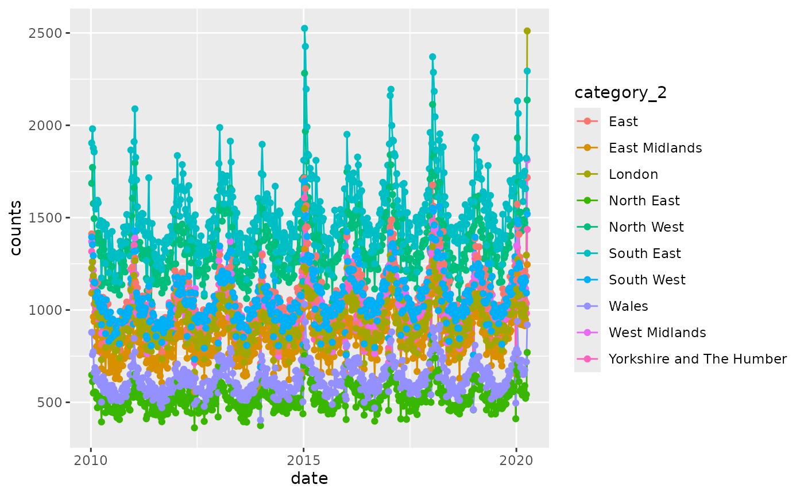
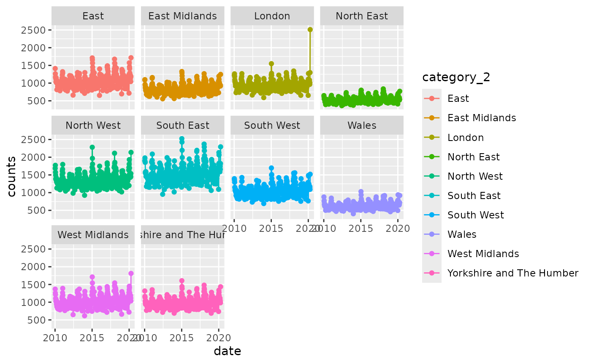

# Dataset: ONS Weekly Provisional Registered Deaths in England and Wales

``` r

library(NHSRdatasets)

ons_mortality <- NHSRdatasets::ons_mortality
```

This vignette details why the `ons_mortality` dataset was created and
how to load it.

## Deaths registered weekly in England and Wales, provisional

Provisional counts of the number of deaths registered in England and
Wales, by age, sex and region, from week commencing 8th January 2010 to
3rd April 2020.

This data has been made available through [Office of National Statistics
under the Open Government
Licence](https://www.nationalarchives.gov.uk/doc/open-government-licence/version/3/)
but is made available in wide form across separate year’s Excel
spreadsheets. These were brought together, tidied in a way they could be
merged together and produced in long form using the code in the
[`vignette("create_ons_mortality")`](https://nhs-r-community.github.io/NHSRdatasets/articles/create_ons_mortality.md)
and a blog can be found on the [NHS-R Community
website](https://nhsrcommunity.com/blog/building-the-ons-mortality-dataset.html).

This data continues to be made available by ONS but is not added to this
dataset. Corrections may have occurred too between this data snapshot
and what is available through the ONS website.

The dataset contains:

- **category_1:** character with categories that relate to grouped data
  like Persons, Males and Females but also for some other parts of the
  Excel dataset that aren’t headers like “average of same week over 5
  years”
- **category_2:** character with categories for grouped ages, age bands
  and regions as well as text from Excel spreadsheets like “v 2013
  (IRIS)”
- **counts:** numeric as counts of deaths recorded
- **date:** date format as yyyy-mm-dd
- **week_no:** integer relating to the week number starting at the first
  week of the year

### Exploring the data

Looking at the unique values in `category_1` using base R which produces
the data output as a data frame

``` r

unique(ons_mortality$category_1)
#> [1] "Total deaths"                                                                         
#> [2] "All respiratory diseases (ICD-10 J00-J99) ICD-10"                                     
#> [3] "Persons"                                                                              
#> [4] "Males"                                                                                
#> [5] "Females"                                                                              
#> [6] "Region"                                                                               
#> [7] NA                                                                                     
#> [8] "average of same week over 5 years"                                                    
#> [9] "Deaths where COVID-19 was mentioned on the death certificate (ICD-10 U07.1 and U07.2)"
```

or using dplyr which produces the data output as a tibble

``` r

ons_mortality |>
  dplyr::distinct(category_1)
```

there is a category `NA` which may not have information that can be
used. When filtering for `NA` using `dplyr` we can combine it with the
base R function [`is.na()`](https://rdrr.io/r/base/NA.html)

``` r

ons_mortality |>
  dplyr::filter(is.na(category_1))
#> # A tibble: 52 × 5
#>    category_1 category_2 counts date       week_no
#>    <chr>      <chr>       <dbl> <date>       <int>
#>  1 NA         NA           1779 2014-01-03       1
#>  2 NA         NA           1925 2014-01-10       2
#>  3 NA         NA             NA 2014-01-17       3
#>  4 NA         NA             NA 2014-01-24       4
#>  5 NA         NA             NA 2014-01-31       5
#>  6 NA         NA             NA 2014-02-07       6
#>  7 NA         NA             NA 2014-02-14       7
#>  8 NA         NA             NA 2014-02-21       8
#>  9 NA         NA             NA 2014-02-28       9
#> 10 NA         NA             NA 2014-03-07      10
#> # ℹ 42 more rows
```

Incidentally to remove rows with `NA` an `!` is needed before the
function in order to negate it

``` r

ons_mortality |>
  dplyr::filter(!is.na(category_1))
```

Or the function
[`filter_out()`](https://dplyr.tidyverse.org/reference/filter.html) can
be used which can make this easier to read as it may be easy to overlook
a single character `!`

``` r

ons_mortality |>
  dplyr::filter_out(is.na(category_1))
```

There are 52 rows with `category_1` that is `NA` and to view them all
that’s possible in the console by extending the tibble view with

``` r

library(magrittr)

ons_mortality |>
  dplyr::filter(is.na(category_1)) %>%
  print(n = nrow(.))
#> # A tibble: 52 × 5
#>    category_1 category_2 counts date       week_no
#>    <chr>      <chr>       <dbl> <date>       <int>
#>  1 NA         NA           1779 2014-01-03       1
#>  2 NA         NA           1925 2014-01-10       2
#>  3 NA         NA             NA 2014-01-17       3
#>  4 NA         NA             NA 2014-01-24       4
#>  5 NA         NA             NA 2014-01-31       5
#>  6 NA         NA             NA 2014-02-07       6
#>  7 NA         NA             NA 2014-02-14       7
#>  8 NA         NA             NA 2014-02-21       8
#>  9 NA         NA             NA 2014-02-28       9
#> 10 NA         NA             NA 2014-03-07      10
#> 11 NA         NA             NA 2014-03-14      11
#> 12 NA         NA             NA 2014-03-21      12
#> 13 NA         NA             NA 2014-03-28      13
#> 14 NA         NA             NA 2014-04-04      14
#> 15 NA         NA             NA 2014-04-11      15
#> 16 NA         NA             NA 2014-04-18      16
#> 17 NA         NA             NA 2014-04-25      17
#> 18 NA         NA             NA 2014-05-02      18
#> 19 NA         NA             NA 2014-05-09      19
#> 20 NA         NA             NA 2014-05-16      20
#> 21 NA         NA             NA 2014-05-23      21
#> 22 NA         NA             NA 2014-05-30      22
#> 23 NA         NA             NA 2014-06-06      23
#> 24 NA         NA             NA 2014-06-13      24
#> 25 NA         NA             NA 2014-06-20      25
#> 26 NA         NA             NA 2014-06-27      26
#> 27 NA         NA             NA 2014-07-04      27
#> 28 NA         NA             NA 2014-07-11      28
#> 29 NA         NA             NA 2014-07-18      29
#> 30 NA         NA             NA 2014-07-25      30
#> 31 NA         NA             NA 2014-08-01      31
#> 32 NA         NA             NA 2014-08-08      32
#> 33 NA         NA             NA 2014-08-15      33
#> 34 NA         NA             NA 2014-08-22      34
#> 35 NA         NA             NA 2014-08-29      35
#> 36 NA         NA             NA 2014-09-05      36
#> 37 NA         NA             NA 2014-09-12      37
#> 38 NA         NA             NA 2014-09-19      38
#> 39 NA         NA             NA 2014-09-26      39
#> 40 NA         NA             NA 2014-10-03      40
#> 41 NA         NA             NA 2014-10-10      41
#> 42 NA         NA             NA 2014-10-17      42
#> 43 NA         NA             NA 2014-10-24      43
#> 44 NA         NA             NA 2014-10-31      44
#> 45 NA         NA             NA 2014-11-07      45
#> 46 NA         NA             NA 2014-11-14      46
#> 47 NA         NA             NA 2014-11-21      47
#> 48 NA         NA             NA 2014-11-28      48
#> 49 NA         NA             NA 2014-12-05      49
#> 50 NA         NA             NA 2014-12-12      50
#> 51 NA         NA             NA 2014-12-19      51
#> 52 NA         NA             NA 2014-12-26      52
```

Notice that this code has used the pipe `%>%` which comes from the
package `magrittr` which is also in `tidyverse`. This pipe, rather than
the base R \|\> allows the data to pass to the next level which is seen
as `.`.

It’s not clear from this search what the counts 1779 and 1925 relate to
(other than being from January 2014) and this can only be understood by
going back to the original spreadsheets and data manipulation which can
be found in the
[`vignette("create_ons_mortality")`](https://nhs-r-community.github.io/NHSRdatasets/articles/create_ons_mortality.md).

### Small charts exploration

A line chart to see all the Regions using `ggplot2`

``` r

by_region <- ons_mortality |>
  dplyr::filter(category_1 == "Region") |>
  ggplot2::ggplot(ggplot2::aes(date, counts, colour = category_2)) +
  ggplot2::geom_line() +
  ggplot2::geom_point()

by_region
```



In the view of small charts using the facet grid to show each area
separately

``` r

by_region + ggplot2::facet_wrap(~category_2)
```


