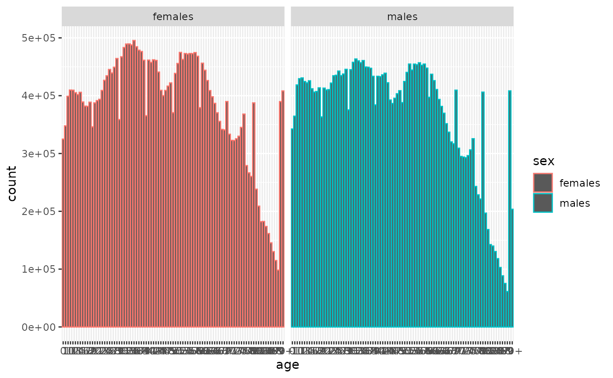

# Dataset: ONS UK population 2023

``` r

library(NHSRdatasets)

ons_uk_population_2023 <- NHSRdatasets::ons_uk_population_2023
```

This vignette details why the `ons_uk_population_2023` dataset was
created and how to load it.

## ONS UK Population 2023

This dataset was added in October 2024 as part of Hacktoberfest The
original data was sourced from the [ONS mid year estimates of population
for England and
Wales](https://www.ons.gov.uk/peoplepopulationandcommunity/populationandmigration/populationestimates/datasets/populationestimatesforukenglandandwalesscotlandandnorthernireland)
and was tidied using the code in
[`vignette("create_ons_uk_population_2023")`](https://nhs-r-community.github.io/NHSRdatasets/articles/create_ons_uk_population_2023.md).

The dataset contains:

- **sex:** character for females and males
- **code:** character code for areas which corresponds to the Name
  column
- **name:** character for areas in the UK and in this dataset has been
  restricted to Countries and grouped Countries (United Kingdom and
  Great Britain)
- **geography:** character detail on area and in this dataset is just
  Country
- **age:** character with age in years from 0 to 90+
- **count:** number referring to the count of population

### Small charts exploration

A bar chart to see all the Regions using `ggplot2`

``` r

ons_uk_population_2023 |>
  dplyr::filter(name == "UNITED KINGDOM") |>
  ggplot2::ggplot(ggplot2::aes(age, count, colour = sex)) +
  ggplot2::geom_col() +
  ggplot2::facet_wrap(~sex)
```



Looking at the chart there seems to be a spike in numbers towards the
latter ages.

Scanning the ages they are in order so looking at the last 5 ages for
both sexes, male and female

``` r

ons_uk_population_2023 |>
  dplyr::filter(name == "UNITED KINGDOM") |>
  dplyr::slice_tail(n = 5, by = sex)
#> # A tibble: 10 × 6
#>    sex     code      name           geography age    count
#>    <chr>   <chr>     <chr>          <chr>     <chr>  <dbl>
#>  1 females K02000001 UNITED KINGDOM Country   86    145357
#>  2 females K02000001 UNITED KINGDOM Country   87    130223
#>  3 females K02000001 UNITED KINGDOM Country   88    114850
#>  4 females K02000001 UNITED KINGDOM Country   89     98220
#>  5 females K02000001 UNITED KINGDOM Country   90+   408216
#>  6 males   K02000001 UNITED KINGDOM Country   86    102785
#>  7 males   K02000001 UNITED KINGDOM Country   87     88388
#>  8 males   K02000001 UNITED KINGDOM Country   88     75138
#>  9 males   K02000001 UNITED KINGDOM Country   89     61154
#> 10 males   K02000001 UNITED KINGDOM Country   90+   203503
```

we can see that there is an unusual increase in numbers for the 90+ age
group for both males and females
